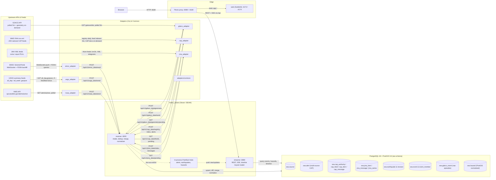

# MatrixWhale

A Data manager.

MatrixWhale is developed as a foundation for processing large amounts of data, and it consists of a group of applications that allow users to interactively search, manipulate, and analyze this data through a web interface. These applications were initially created with reference to NOAA's API endpoints and are designed to enable users to gain deeper insights from complex, diverse, and large-scale data on their own. (There are plans to expand its functionality in the future.)

## Demo

Live NWS alerts, national CAP alerts from about 130 countries (followed from the WMO Register of Alerting Authorities), USGS & EMSC earthquakes, and GDACS multi-hazards (tropical cyclones, floods, volcanoes, wildfires, droughts, and tsunamis) on the nautical chart at `/globe`, in day and night palettes. A tabbed side pane provides arrival-ordered Timeline, Earthquakes, Hazards, Alerts, and Feed views with real-time SSE streaming, severity filtering, and drill-in detail panels.

<table>
  <tr>
    <td align="center">
      
      <br>Day
    </td>
    <td align="center">
      
      <br>Night
    </td>
  </tr>
</table>

## Architecture

The diagram below reflects the live data paths across all integrated sources: NOAA alerts, national CAP alerts, USGS earthquakes, EMSC earthquakes, GDACS multi-hazards, and JMA disaster prevention XML flow from upstream services through Go adapters into the Gleam/BEAM core, which normalizes, deduplicates, and merges records into PostgreSQL 18 + PostGIS 3.6, streaming them out to the browser through the Plecto reverse proxy.



- **Go adapters** ingest data on source-optimal schedules and share common utilities (`adapters/common`) for core HTTP clients, backoff, structured logging, and User-Agent headers:
  - `noaa_adapter`: Polls NWS active alerts and sends raw GeoJSON envelopes to the core receiver.
  - `usgs_adapter`: Starts with `all_week.geojson` backfill, switches to `all_day.geojson` with conditional GET (`If-Modified-Since`, >=60s floor), retrying safely on delivery failures.
  - `emsc_adapter`: Subscribes to real-time WebSocket push (`standing_order`), backfills via FDSN query, and runs gap-fill queries on reconnects.
  - `gdacs_adapter`: Polls multi-hazard events every 5 minutes (with a 10s minimum request interval), and pulls pending episode geometries in the background driven by the core's pending queue.
  - `cap_adapter`: Reads the WMO Register of Alerting Authorities daily, polls each subscribed national CAP feed index every 5 minutes with conditional GET (one request per host at a time, 2s apart), and fetches the CAP documents the core lists as pending, converting CAP XML into a lossless JSON mirror.
  - `jma_adapter`: Polls JMA (気象庁) disaster prevention XML pull feeds (`extra.xml` warnings/advisories, `eqvol.xml` earthquakes) on a 1-minute cycle (`extra_l`, `eqvol_l` on 1 hour), strictly enforces a voluntary 1GiB/day safety cap (against JMA's published 10GB/day IP blocking policy), persists deduplication and spool state in `/var/lib/jma`, and respects attribution/editing responsibility terms (no EEW claims). See [docs/jma-xml.md](docs/jma-xml.md) and [ADR 0015](docs/ADR/0015-ingest-jma-xml-feeds-with-safe-polling-and-attribution.md).
- **Core (`matrix_whale`)**: Built in Gleam on the Erlang/BEAM VM:
  - **Receiver (`:6000`)**: Classifies revisions and deduplicates incoming payloads in pure Gleam functions (`domain/` and `intake/`). Merges earthquakes from USGS, EMSC, and GDACS into canonical events (`sea.event`), normalizes GDACS raw episodes into `sea.hazard` with PostGIS geometry in the same database transaction, and normalizes national CAP messages into the multi-source `sea.alert` (one transaction per message, Update/Cancel chains applied).
  - **Streamer (`:8080`)**: Serves REST endpoints (`/api/v1/alerts/*` incl. `/api/v1/alerts/detail`, `/api/v1/cap/feeds`, `/api/v1/earthquakes/recent`, `/api/v1/hazards/recent`, `/api/v1/hazards/{source}/{source_id}`, `/api/v1/timeline`, `/api/v1/sources`, `/api/v1/pipeline/status`) and real-time SSE streams (`/api/v1/alerts/stream`, `/api/v1/earthquakes/stream`, `/api/v1/hazards/stream`).
  - **In-process pub/sub hubs**: Sibling OTP processes on the same BEAM node provide low-latency fan-out from receiver to streamer without external message brokers. The browser shares one `/api/v1/stream?geometry=polyline` SSE connection for alerts, earthquakes, and hazards, with lossless hazard geometry decoding and snapshot revalidation on reconnect. Individual stream endpoints remain available. See the [SSE network measurements](perf/sse-network-2026-09-20.md).
- **Database (PostgreSQL 18 + PostGIS 3.6)**:
  - `sea.source`: Central registry for licenses, priorities, and attribution text.
  - `sea.earthquake` & `sea.earthquake_revision`: 7-day rolling window of earthquake source rows with full revision histories.
  - `sea.event` & `sea.event_member`: Canonical merged earthquakes combining cross-source detections by origin/ID matching and spatio-temporal misfit scoring.
  - `sea.gdacs_event`: Raw GDACS episode storage preserving all historical episodes and unprojected GeoJSON geometry.
  - `sea.hazard`: Normalized multi-hazard layer containing PostGIS `Point` centroid, `Polygon` bbox, and `Geometry` primary polygon with GiST spatial indexes.
  - `sea.alert`: Multi-source CAP-shaped alerts (NOAA and every national alerting authority) keyed by `(source, source_id)`, with PostGIS `MultiPolygon` geometry, `active_until`, and `ended_at`/`end_reason` (`expired`, `cancelled`, `superseded`, `withdrawn`).
  - `sea.cap_authority`, `sea.cap_feed`, `sea.cap_item`, `sea.cap_message`: The RAA registry, per-feed health, feed index items (the pending queue), and raw CAP messages (JSON mirror + raw XML).
- **Edge**:
  - **Plecto reverse proxy (`:8080` / `:8180`)**: Single entry point routing `/api` to the Gleam streamer and everything else to the SvelteKit frontend, enforcing rate limits, edge security headers, and response compression.
  - **Web (`:4173` / `:4174`)**: SvelteKit application with MapLibre GL rendering nautical charts (`/globe`), earthquake flasher markers, hazard polygons, a 5-tab side pane (Timeline, Earthquakes, Hazards, Alerts, Feed), and a `/feeds` page with per-feed CAP health.

## Database migrations

`db/schema.sql` is the desired state of the `sea` schema; [Atlas](https://atlasgo.io) generates and applies versioned migrations from it under `db/migrations/`. The database runs PostgreSQL 18 with PostGIS 3.6 (`postgis/postgis:18-3.6`) storing its data in `./db/data18` (matching PostgreSQL 18's volume layout).

The `migrate` compose service applies pending migrations before `matrix_whale` starts. Database-level extensions (`pg_trgm` and `postgis`) cannot be fully managed by Atlas's community edition, so they are declared in both `db/schema.sql` and the respective versioned migration files (`20260918000000_init.sql` and `20260918110612_gdacs_hazards.sql`).

To change the schema:

1. Edit `db/schema.sql`.
2. `make db-diff name=add_thing` to generate `db/migrations/<timestamp>_add_thing.sql`.
3. Review the generated SQL.
4. `make db-apply` (locally) or run `docker compose up` to apply via the `migrate` service.

Useful database commands:
- `make db-status`: Shows applied and pending migrations against `MATRIX_WHALE_DATABASE_URL` (defaulting to port 5440 in compose).
- `make test-core`: Runs the Gleam integration test suite against a throwaway PostGIS 18 container with all migrations applied.

## Decision records

Architecture decisions are recorded in `docs/ADR/` as numbered Markdown files with YAML frontmatter. [DocDag](https://github.com/Kaikei-e/DocDag) validates the `supersedes` and `depends-on` graph declared in that frontmatter (`make adr-validate` locally, the `decisions` job in CI). Start a new record from `docs/ADR/template.md`.

## USGS earthquake pipeline

`usgs_adapter` starts with the USGS `all_week.geojson` feed and sends that snapshot to MatrixWhale with `poll_meta.backfill=true`. It switches to `all_day.geojson` only after the core accepts the startup snapshot. Subsequent requests honor `Expires`/`Cache-Control`, use `If-Modified-Since`, and forward 304 polls with an empty feature list. The conditional validator advances only after the core POST succeeds, so a delivery failure is retried safely.


Measured 2026-09-17, compressed transfer size ranging from 3.1 KB (`all_hour`) to 7.5 MB (`all_month`); `all_day` is the production poll target at about 134 KB per uncached fetch, 0 bytes on a 304.

The core accepts USGS envelopes up to 17 MiB, including JSON envelope overhead; this exceeds the adapter's 16 MiB feed ceiling so a valid maximum-size feed cannot enter a 413 retry loop.

The adapter stores every magnitude by default, including `null`. Set `USGS_MIN_MAG` only when an ingestion-side filter is explicitly wanted; the globe's display threshold remains a frontend concern. `USGS_CONTACT_EMAIL` is optional and is included in the User-Agent when set. The adapter uses `MATRIX_WHALE_URL` internally in tests and defaults to `http://matrix_whale:6000/api/v1` in compose.

USGS data is public domain; MatrixWhale identifies it as courtesy of the U.S. Geological Survey in its data presentation. The core retention job removes the latest earthquake row and related revisions after seven days from `occurred_at` in one transaction, without extending the deadline when an old event is revised. Standard autovacuum reuses the released space. `pg_total_relation_size('sea.earthquake')`, `pg_table_size(...)`, and `pg_indexes_size(...)` provide the first capacity measurements. `VACUUM FULL` is an exceptional maintenance operation because it rewrites the table and requires a strong lock.

Because the production poll switches from all_week to all_day, a revision more than 24 hours after occurrence can disappear from the normal feed even though the row is retained for seven days. The stored revision history is therefore the set of versions observed by the adapter, not a guarantee of every USGS-side revision. A separate periodic all_week reconciliation is required if complete seven-day revision coverage becomes a requirement.

`GET /api/v1/earthquakes/recent` defaults to the latest 24 hours at M2.5+; `hours=1..168`, `minmag=<number>|all`, and `type=earthquake|all` refine the snapshot, filtering on each canonical event's projected columns. It returns `{"earthquakes": [<Event>, ...]}`, where each event carries its projected scalar fields (from the highest-priority, most-recently-updated member) plus a `members` list of every linked source row with its `matched_by` (`origin`, `id`, or `misfit`) and `misfit` score. It sends a content-hash ETag and `Cache-Control: no-cache`; clients should revalidate it. `GET /api/v1/earthquakes/stream` emits the same canonical event JSON in `new` and `update` events with `is_backfill`, plus `heartbeat` and `resync`; `new` is a newly created event, `update` is a change to an existing event's projection (a member added, revised, or its status changed). The event id contains a process epoch. A reconnect receives `resync` and must refetch the snapshot rather than assuming a replay buffer survived a core restart.

`GET /api/v1/pipeline/status` keeps the existing NOAA top-level fields and adds per-source statistics under `sources.<source_id>` (`noaa`, `usgs`, `emsc`, `gdacs`, and `cap`), each with `last_fetch_at`, `last_http_status`, `received`, `deduped`, `written`, `dropped`, `bytes`, a `dedup` breakdown (`intake`, `unchanged`, `stale`), and `matched` (how many of that source's rows in the most recent write attached to an existing canonical event rather than creating one).

`GET /api/v1/sources` returns the core's source registry (`id`, `name`, `homepage`, `license`, `attribution_text`, `redistributable`, `priority`; the static `noaa`, `usgs`, `emsc`, and `gdacs` rows plus one `cap-<oid>` row per RAA alerting authority, read from `sea.source`) — the only place clients get license/attribution text; canonical events carry a `preferred_source`/`sources` list but no license fields of their own.

Start it with `docker compose --env-file .env up --build usgs_adapter` after MatrixWhale and PostgreSQL are available. The adapter shuts down when it receives SIGTERM/SIGINT and does not advance a feed validator if the core POST fails.

Run adapter checks locally with:

```sh
cd usgs_adapter/app
go test -race ./...
go vet ./...
go build ./...
```

## EMSC earthquake pipeline

`emsc_adapter` subscribes to EMSC's real-time WebSocket feed (`wss://www.seismicportal.eu/standing_order/websocket`) and pings it every 15s, since the server never pings first. On startup it backfills the last `EMSC_BACKFILL_DAYS` (default 7) days from the FDSN event webservice (`https://www.seismicportal.eu/fdsnws/event/1/query`), paginating by offset until a page returns fewer than the request limit, and POSTs each page with `poll_meta.backfill=true`; a failed fetch or core POST is retried with backoff without advancing the offset. Live messages are buffered and flushed to the core every 100 messages or 500ms, whichever comes first, with `poll_meta.backfill=false`; a failed core POST is retried with backoff for the same batch, never dropped or reordered.

On any WebSocket error or close, the adapter reconnects with backoff (5s floor, 10min ceiling, up to 5s jitter) and then runs one FDSN gap-fill query with `updatedafter` set to the latest `lastupdate` seen minus 5 minutes, bounded by the same `EMSC_BACKFILL_DAYS` window, before resuming the live subscription.

Both backfill and live messages are POSTed to `POST /api/v1/emsc_data/send` as `{"action": "create"|"update"|"delete", "data": <GeoJSON Feature>}` entries; backfill features (which arrive bare from FDSN) are wrapped as `"create"` so the core has a single decoder for both sources.

EMSC data is CC BY 4.0; MatrixWhale credits it as "EMSC/CSEM, https://www.emsc-csem.org" in its data presentation. `EMSC_CONTACT_EMAIL` is optional and is included in the User-Agent when set. `EMSC_WEBSOCKET_URL`, `EMSC_FDSN_URL`, and `EMSC_BACKFILL_DAYS` override the defaults above and exist mainly for tests. The adapter uses `MATRIX_WHALE_URL` internally and defaults to `http://matrix_whale:6000/api/v1` in compose.

Start it with `docker compose --env-file .env up --build emsc_adapter` after MatrixWhale is available. The adapter shuts down on SIGTERM/SIGINT.

Run adapter checks locally with:

```sh
cd emsc_adapter/app
go test -race ./...
go vet ./...
go build ./...
```

## GDACS multi-hazard pipeline

`gdacs_adapter` polls GDACS (Global Disaster Alert and Coordination System) every 5 minutes (`GDACS_POLL_INTERVAL`) for earthquakes, tropical cyclones, floods, volcanoes, wildfires, droughts, and tsunamis. It sends raw event pages to `POST /api/v1/gdacs_data/send` with a 14-day startup backfill. Between ticks, it fetches pending episode geometries from `GET /api/v1/gdacs_data/geometry/pending` and POSTs them to `POST /api/v1/gdacs_data/geometry` with a 10s rate limiter (`GDACS_MIN_REQUEST_INTERVAL`).

The core stores raw episodes in `sea.gdacs_event` and normalizes the latest episode into `sea.hazard` with PostGIS geometry (`centroid Point`, `bbox Polygon`, `primary_geometry Geometry`) and CAP-aligned severity (`green -> minor`, `orange -> severe`, `red -> extreme`). When earthquake geometry arrives with an NEIC/USGS ID, the event is dual-written to `sea.earthquake` and merged into the canonical earthquake model. GDACS data is credited as "Global Disaster Awareness and Coordination System, GDACS".

Start it with `docker compose --env-file .env up --build gdacs_adapter` after MatrixWhale and PostgreSQL are available.

Run adapter checks locally with:

```sh
cd gdacs_adapter/app
go test -race ./...
go vet ./...
go build ./...
```

## National CAP alerts via the WMO Register of Alerting Authorities

`cap_adapter` reads the WMO Register of Alerting Authorities (`https://alertingauthority.wmo.int/rss.xml`, RSS 2.0) at startup and daily (`CAP_REGISTRY_INTERVAL`) and posts every entry to `POST /api/v1/cap_data/registry`. The core decides which feeds to subscribe: NWS feeds are excluded (covered by `noaa_adapter`), and when an authority lists an English feed its other-language feeds are skipped. Each authority becomes a `sea.source` row `cap-<oid>` credited as "<authority> (<country>), via the WMO Register of Alerting Authorities".

Every 5 minutes (`CAP_POLL_INTERVAL`) the adapter reads `GET /api/v1/cap_data/feeds`, polls each due feed index with conditional GET, and posts the items to `POST /api/v1/cap_data/index` (also on failure, which drives per-feed health and back-off to 1 h / 6 h after repeated failures). For the rest of the cycle it fetches the CAP documents listed by `GET /api/v1/cap_data/pending` and posts them to `POST /api/v1/cap_data/alerts`. Index items published more than 7 days ago are never fetched. Requests are limited to one in flight per host with a 2s gap (`CAP_HOST_MIN_INTERVAL`) and 8 hosts at once (`CAP_MAX_PARALLEL_HOSTS`).

The core stores each message in `sea.cap_message` keyed by `(sender, identifier)` and normalizes `Actual` + `Public` Alert/Update messages into `sea.alert`, preferring the English `<info>` and the highest severity among the display-language infos. Polygons and circles become a PostGIS `MultiPolygon`; geocode-only alerts are listed but not drawn. Updates mark the referenced alerts `superseded`, Cancels mark them `cancelled`, including when messages arrive out of order. `GET /api/v1/cap/feeds` (and the web `/feeds` page) reports each feed's health (`ok`, `empty`, `stale`, `degraded`, `failing`, `pending`, `excluded`).

Run adapter checks locally with:

```sh
cd cap_adapter/app
go test -race ./...
go vet ./...
```

## Arrival-ordered timeline

`GET /api/v1/timeline` streams all event kinds (`earthquake`, `hazard`, `alert`) in arrival order (`first_seen_at DESC`) using keyset pagination (`?limit=50&before=<cursor>&kinds=...&minmag=...&min_severity=...`). The cursor is an opaque base64url string. Severity across sources is normalized to CAP levels (minor, moderate, severe, extreme).

On the `/globe` side pane, the **Timeline** tab combines this keyset API with real-time SSE streams, displaying sticky "N new" pills for background arrivals, in-place update badges, and kind-specific detail drill-ins.
