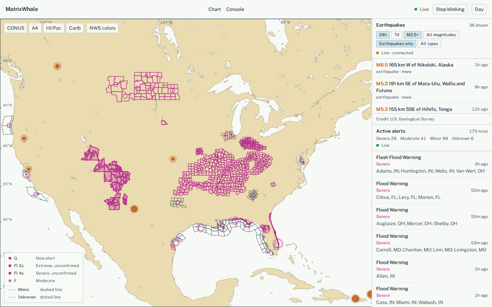
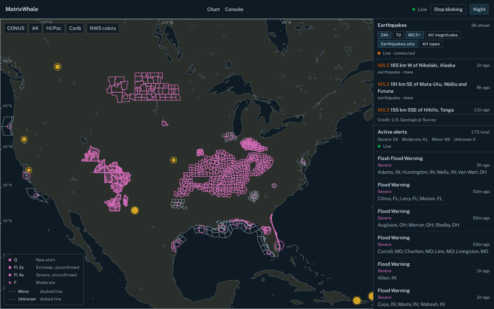
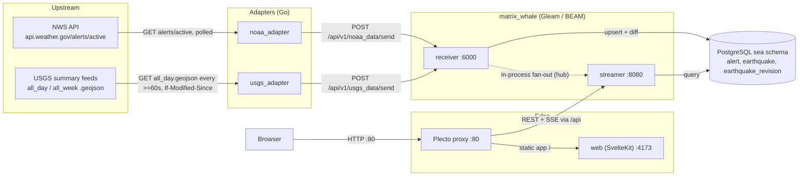
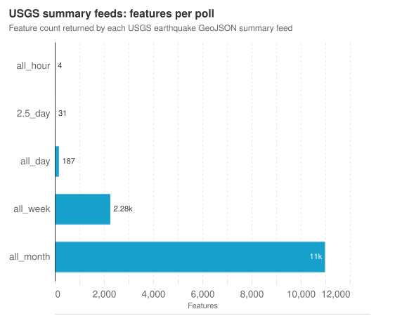

# MatrixWhale

A Data manager.

MatrixWhale is developed as a foundation for processing large amounts of data, and it consists of a group of applications that allow users to interactively search, manipulate, and analyze this data through a web interface. These applications were initially created with reference to NOAA's API endpoints and are designed to enable users to gain deeper insights from complex, diverse, and large-scale data on their own. (There are plans to expand its functionality in the future.)

## Demo

Live NWS alerts and USGS earthquakes on the nautical chart at `/globe`, day and night palettes.

<table>
  <tr>
    <td align="center">
      
      <br>Day
    </td>
    <td align="center">
      
      <br>Night
    </td>
  </tr>
</table>

## Architecture

The diagram below covers only the paths that carry data today: NOAA alerts and USGS earthquakes flow from their upstream APIs through Go adapters into the Gleam/BEAM core, which persists them in PostgreSQL and fans them out to the browser through the Plecto proxy.



- The `noaa_adapter` and `usgs_adapter` Go services poll their upstream APIs on their own schedules (USGS honors `Expires`/`Cache-Control` with a >=60s floor) and POST raw GeoJSON envelopes to the core's receiver on port 6000.
- The receiver upserts alerts and earthquakes into PostgreSQL, diffs earthquakes against their stored revision, and hands new/updated records to the streamer through an in-process pub/sub hub, both being sibling processes of the same BEAM node.
- The streamer serves REST reads (`/api/v1/alerts/*`, `/api/v1/earthquakes/recent`, `/api/v1/pipeline/status`) and SSE feeds (`/api/v1/alerts/stream`, `/api/v1/earthquakes/stream`) on port 8080, all reading from the same PostgreSQL tables.
- The Plecto proxy is the single public entry point on port 80: it forwards `/api` to the streamer and everything else to the SvelteKit `web` app, which the browser talks to directly for both.
- Earthquakes keep a rolling 7-day window (`sea.earthquake`), with every observed revision kept in `sea.earthquake_revision` until its parent row is retired.

## USGS earthquake pipeline

`usgs_adapter` starts with the USGS `all_week.geojson` feed and sends that snapshot to MatrixWhale with `poll_meta.backfill=true`. It switches to `all_day.geojson` only after the core accepts the startup snapshot. Subsequent requests honor `Expires`/`Cache-Control`, use `If-Modified-Since`, and forward 304 polls with an empty feature list. The conditional validator advances only after the core POST succeeds, so a delivery failure is retried safely.



Measured 2026-09-17, compressed transfer size ranging from 3.1 KB (`all_hour`) to 7.5 MB (`all_month`); `all_day` is the production poll target at about 134 KB per uncached fetch, 0 bytes on a 304.

The core accepts USGS envelopes up to 17 MiB, including JSON envelope overhead; this exceeds the adapter's 16 MiB feed ceiling so a valid maximum-size feed cannot enter a 413 retry loop.

The adapter stores every magnitude by default, including `null`. Set `USGS_MIN_MAG` only when an ingestion-side filter is explicitly wanted; the globe's display threshold remains a frontend concern. `USGS_CONTACT_EMAIL` is optional and is included in the User-Agent when set. The adapter uses `MATRIX_WHALE_URL` internally in tests and defaults to `http://matrix_whale:6000/api/v1` in compose.

USGS data is public domain; MatrixWhale identifies it as courtesy of the U.S. Geological Survey in its data presentation. The core retention job removes the latest earthquake row and related revisions after seven days from `occurred_at` in one transaction, without extending the deadline when an old event is revised. Standard autovacuum reuses the released space. `pg_total_relation_size('sea.earthquake')`, `pg_table_size(...)`, and `pg_indexes_size(...)` provide the first capacity measurements. `VACUUM FULL` is an exceptional maintenance operation because it rewrites the table and requires a strong lock.

Because the production poll switches from all_week to all_day, a revision more than 24 hours after occurrence can disappear from the normal feed even though the row is retained for seven days. The stored revision history is therefore the set of versions observed by the adapter, not a guarantee of every USGS-side revision. A separate periodic all_week reconciliation is required if complete seven-day revision coverage becomes a requirement.

`GET /api/v1/earthquakes/recent` defaults to the latest 24 hours at M2.5+; `hours=1..168`, `minmag=<number>|all`, and `type=earthquake|all` refine the snapshot. It sends a content-hash ETag and `Cache-Control: no-cache`; clients should revalidate it. `GET /api/v1/earthquakes/stream` emits flat earthquake JSON in `new` and `update` events with `is_backfill`, plus `heartbeat` and `resync`. The event id contains a process epoch. A reconnect receives `resync` and must refetch the snapshot rather than assuming a replay buffer survived a core restart.

`GET /api/v1/pipeline/status` keeps the existing NOAA top-level fields and adds `sources.noaa` and `sources.usgs`, each with `last_fetch_at`, `last_http_status`, `received`, `deduped`, `written`, `dropped`, and `bytes` for its most recent successful core write.

Start it with `docker compose --env-file .env up --build usgs_adapter` after MatrixWhale and PostgreSQL are available. The adapter shuts down when it receives SIGTERM/SIGINT and does not advance a feed validator if the core POST fails.

Run adapter checks locally with:

```sh
cd usgs_adapter/app
go test -race ./...
go vet ./...
go build ./...
```
